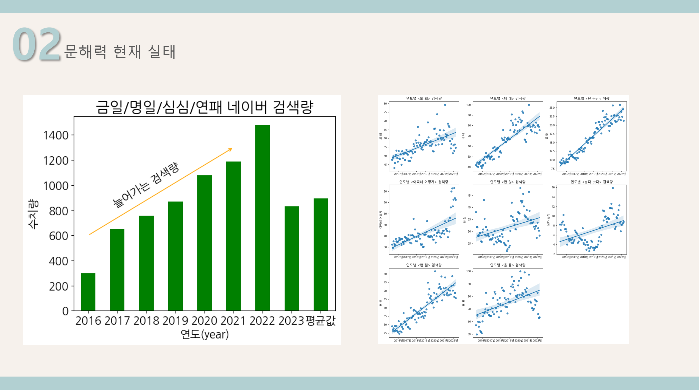
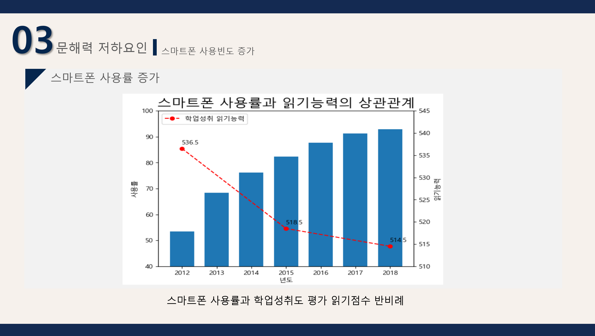
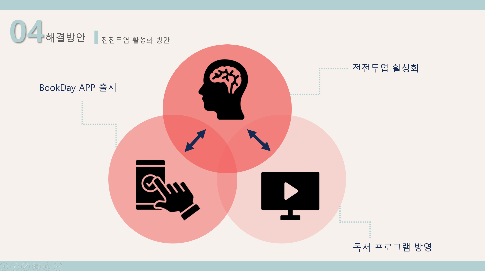

# 🚩 1주차 개인 프로젝트
# **러닝프로그램**
- 러닝데이터를 기록, 데이터기반 훈련방법 및 마라톤 예상시간 도출.

----------------------------------------------------------

## 🖥️ 프로젝트 소개
-  반복문을 사용하여 러닝데이터를 기입, 엑셀 파일로 저장
-  심박존 차트 계산후 데이터 기반 훈련 방법 제공
-  수집된 데이터를 기반으로 10km, half, full 코스 마라톤 완주 예상시간 도출
-  데이터를 월별, 전체로 제공
----------------------------------------------------------

## 🕰️ 개발 기간
* 23.07.03일 - 23.07.07일
----------------------------------------------------------

## 🧑‍🤝‍🧑 역할
- 전체 서비스 구상 및 기획
- 파이썬 코드 작성
- 기능 설명 정리 및 PPT 작성
----------------------------------------------------------

## ⚙️ 개발 환경
- Python (Version 3.9.0 / Window)
- <strong>Library: </strong> openpyxl, calendar
- <strong>IDE: </strong> Visual Studio Code

----------------------------------------------------------
## 📓 STACKS
    
 

----------------------------------------------------------
## 📌 프레젠테이션
* 문해력 실태

* 저하 요인

* 해결 방안 
런데이와 같은 bookday 어플로 책 읽어주는 힘 기르기 

