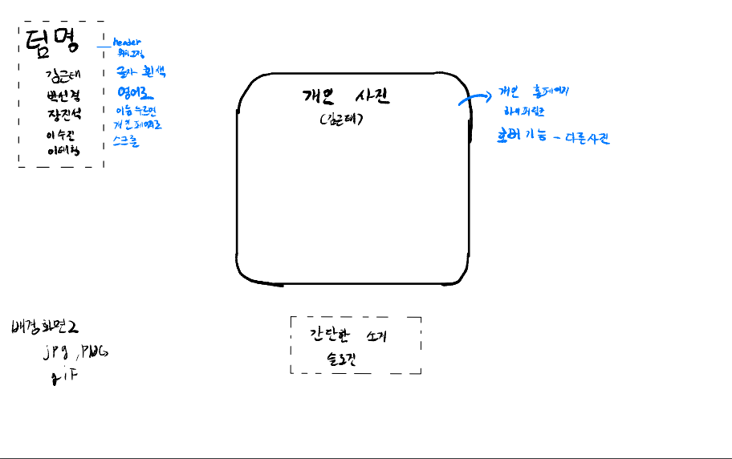
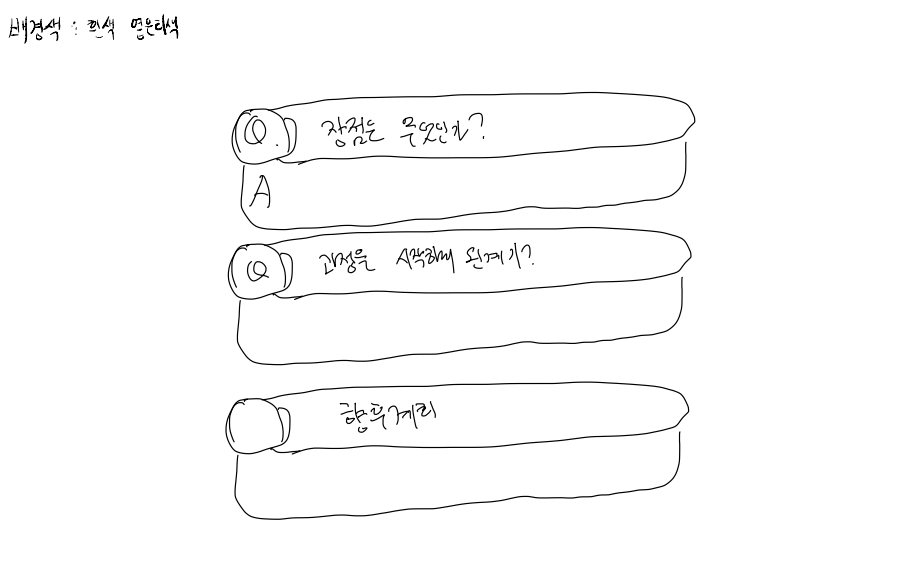
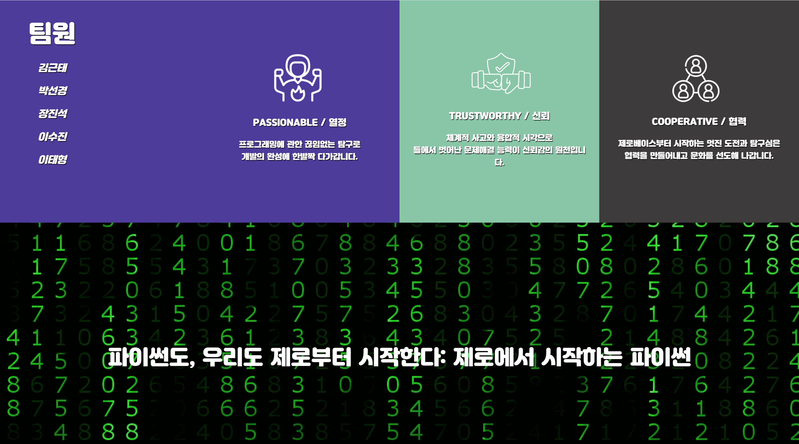
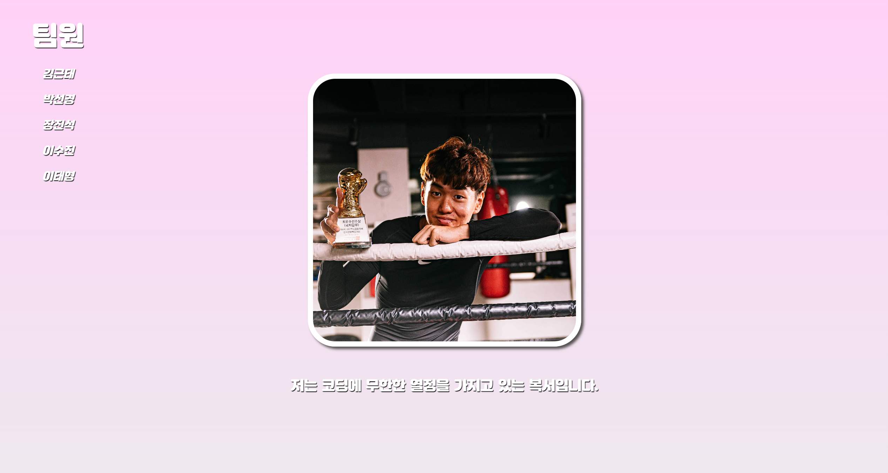
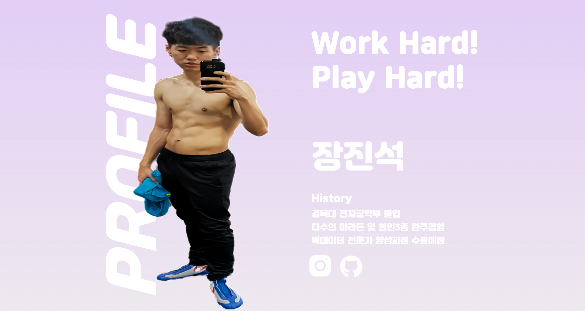
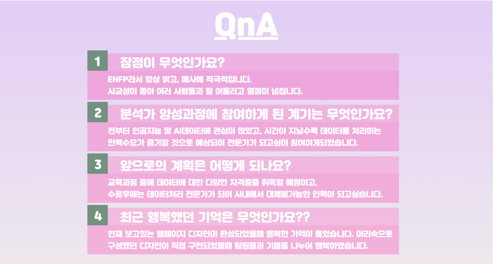
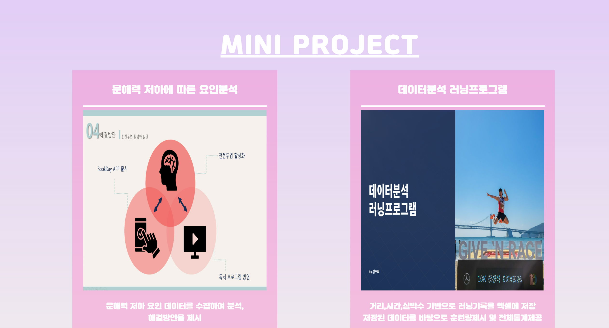

# 🚩 3주차 팀 프로젝트
# **ZeroBase**
----------------------------------------------------------

## 🖥️ 프로젝트 소개
-  html과 css를 사용해 **첫 웹페이지**를 구성
-  메인 페이지는 팀페이지 소개이며, 각자의 사진을 눌러 본인의 자기소개 페이지로 넘어갑니다.
- , **CSS Scroll Snap** 기능을 사용해 웹 페이지의 스크롤 기능을 제어하는 애니메이션 구현

----------------------------------------------------------

## 🧑‍🤝‍🧑 맴버구성
 - 이태형 : 메인페이지 구성, 메인 페이지 목업 구성, CSS Scroll Snap 기능 구현
 - 이수진 : 메인페이지 구성
 - 장진석, 박선경, 김근태 : 서브페이지 구성 , 서브 페이지 목업 구성

----------------------------------------------------------

## ⚙️ 개발 환경
- **Web** : `html5` `css3`
----------------------------------------------------------
## 📓 STACKS
     

----------------------------------------------------------
## 📍 목업
- **메인페이지**

  

- **서브페이지**

----------------------------------------------------------
## 📌 주요 내용
- **메인페이지**

  

- **서브페이지**

